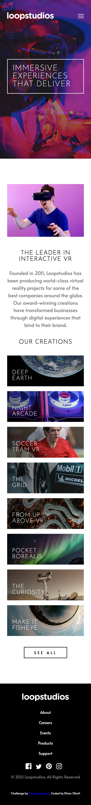

# Frontend Mentor - Loopstudios landing page solution

This is a solution to the [Loopstudios landing page challenge on Frontend Mentor](https://www.frontendmentor.io/challenges/loopstudios-landing-page-N88J5Onjw). Frontend Mentor challenges help you improve your coding skills by building realistic projects.

## Table of contents

-   [The challenge](#the-challenge)
-   [Screenshot](#screenshot)
-   [Links](#links)
-   [My process](#my-process) - [Built with](#built-with)

### The challenge

Users should be able to:

-   View the optimal layout for the site depending on their device's screen size
-   See hover states for all interactive elements on the page

### Screenshot

### Links

-   Solution URL: [Add solution URL here](https://www.frontendmentor.io/solutions/responsive-loopstudios-landing-page-using-flexbox-aj1VjdNjNl)
-   Live Site URL: [Add live site URL here](https://etfx1.github.io/FEM-loopstudios/)

### Built with

-   Semantic HTML5 markup
-   CSS custom properties
-   Flexbox
-   Mobile-first workflow

## Author

-   Frontend Mentor - [@ETFX1](https://www.frontendmentor.io/profile/EtFX1)
